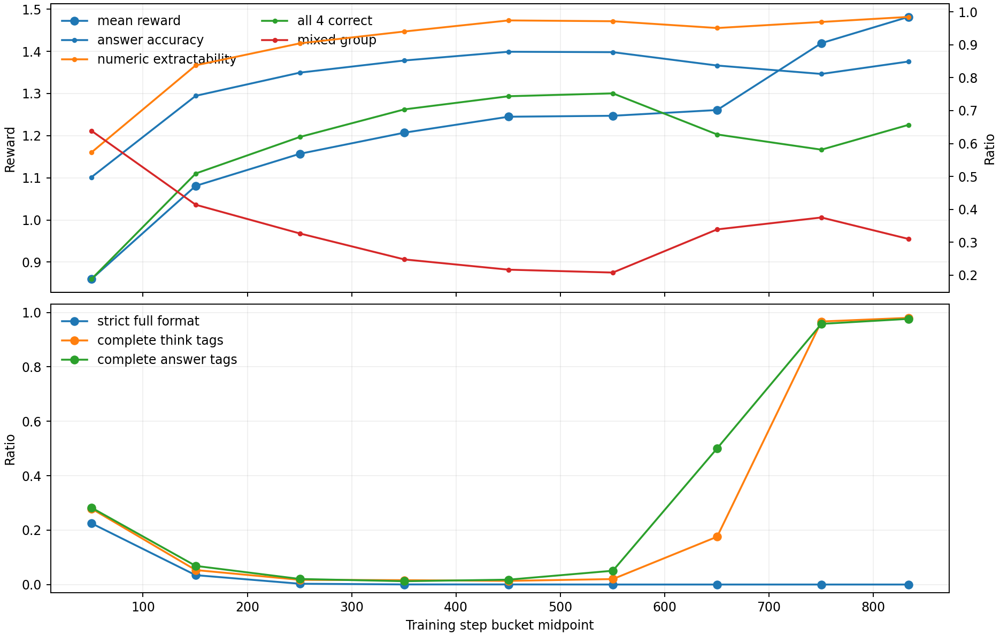
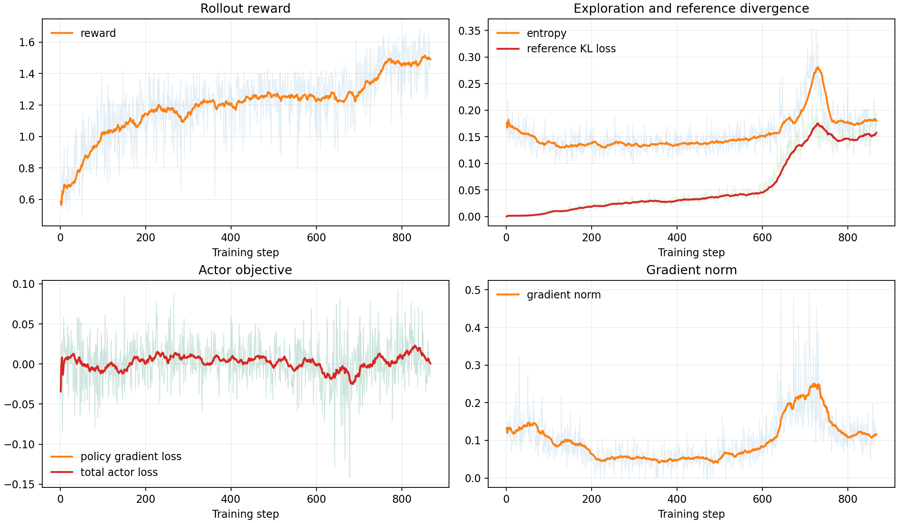
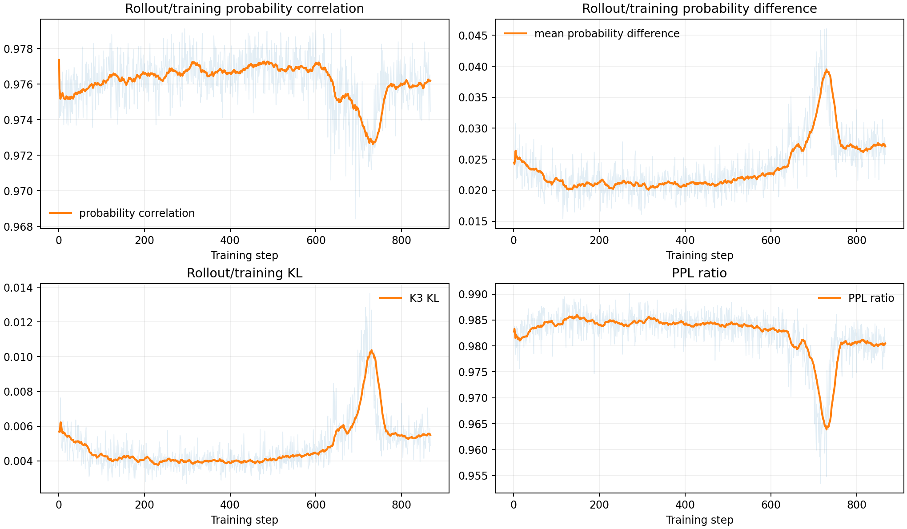
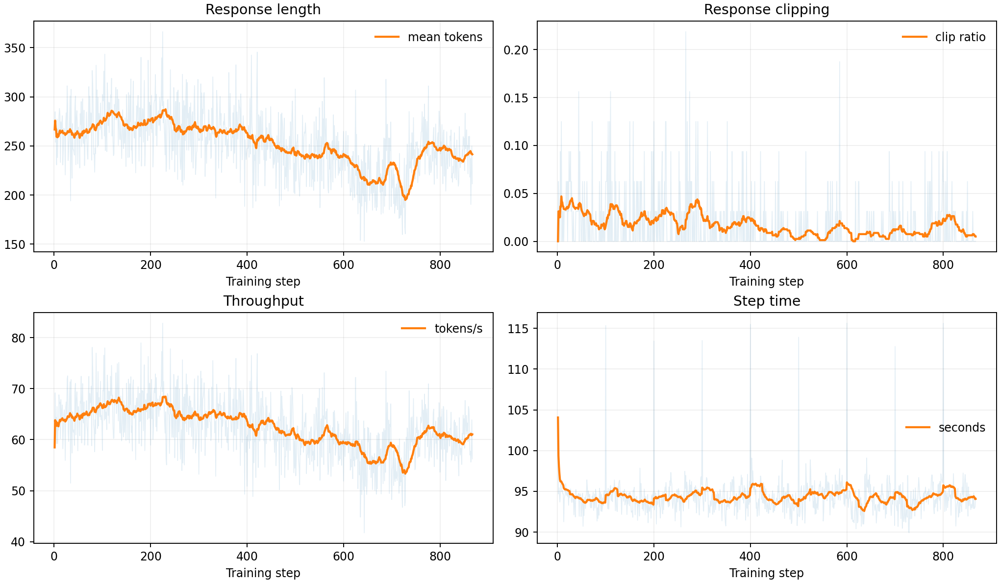
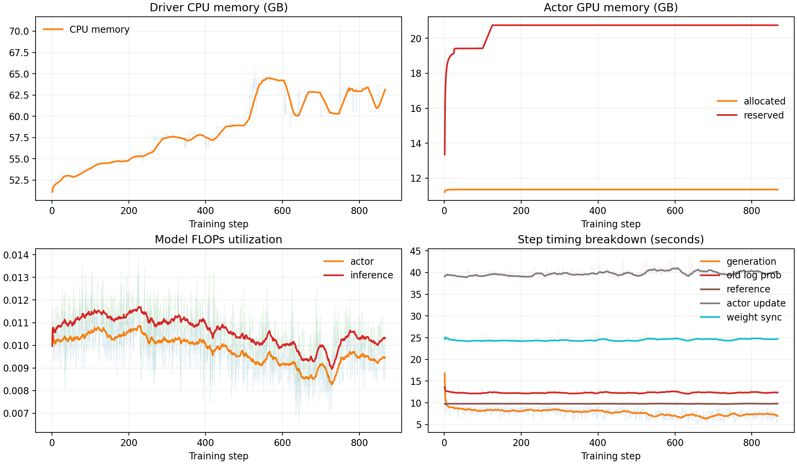
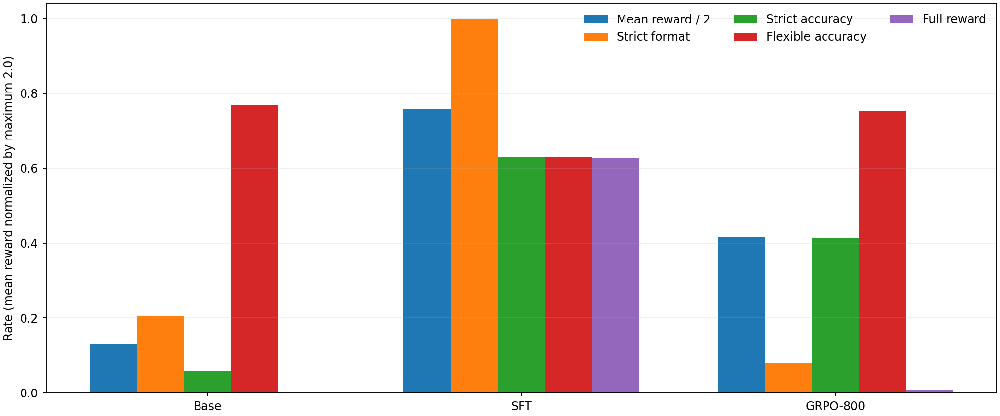

# Qwen2.5-3B GSM8K SFT 与 GRPO 阶段性研究报告

## 摘要

本报告分析 Qwen2.5-3B-Instruct 在 GSM8K 上进行 LoRA SFT 和 GRPO 后的训练走势与模型效果。
GRPO 日志采用固定快照，覆盖 step 1-867；计划总步数为 934，生成报告时训练尚未结束，最新完整
checkpoint 为 step 800。模型效果使用 `data/unprocessed/test.jsonl` 全部 1,319 题、相同 system
prompt、greedy decoding 和 512-token 上限评测。

主要结论如下：

1. **严格输出目标下 SFT 明显最好。** SFT 平均 reward 为 1.5166，严格格式率 99.77%；
   GRPO-800 分别为 0.8308 和 7.88%。当前应把 SFT 作为严格协议输出的基线。
2. **GRPO 保留了更多宽松数学能力，但没有超过 Base。** 宽松数值正确率为 Base 76.88%、
   GRPO-800 75.36%、SFT 62.93%。GRPO 比 SFT 高 12.43 个百分点，但比 Base 低 1.52 个百分点。
3. **训练 reward 上升不等于严格格式学会。** GRPO rollout 平均 reward 从 0.8596 上升到
   1.4817，而严格完整格式从 22.50% 降为 0%。模型学会了标签和 `####` 等局部得分点，但常在
   `<think>` 前或 `</answer>` 后生成额外文本。
4. **当前 reward 存在明显的优化捷径。** 即使严格全文格式失败，只要答案正确、局部标签和过程
   满足要求，仍可得到 1.7/2.0。后期训练 reward 接近 1.7，但真正的全文格式仍为 0%。
5. **下一阶段最有价值的两条实验线是 `DAPO + Base` 和 `GRPO + SFT`。** 前者检验 DAPO
   配方，后者检验 SFT 格式先验能否与 RL 数学能力结合。两者必须使用独立 validation 选 checkpoint。

## 1. 实验问题

本阶段回答四个问题：

- 当前 GRPO 日志中的 reward、答案、格式、优化稳定性和系统性能如何变化？
- GRPO 的训练期 rollout 提升能否迁移到固定测试集？
- SFT 与 GRPO 分别改善了什么能力，又牺牲了什么？
- 后续如何公平比较 DAPO-Base 与 GRPO-on-SFT？

## 2. 实验设置

### 2.1 数据与输出协议

- 训练数据：GSM8K train，共 7,473 题。
- 测试数据：`data/unprocessed/test.jsonl`，共 1,319 题。
- SFT 数据：`data/sft-data/`，所有目标回答都经过当前 reward 校验且得分为 2.0。
- System prompt：要求输出唯一的 `<think>...</think><answer>#### ...</answer>` 结构。

当前 reward 上限为 2.0：

| 分量 | 分值 | 条件 |
| --- | ---: | --- |
| 严格全文格式 | 0.3 | 整个回复必须被规定标签完整包围 |
| 标签 marks | 0.1 | 四个局部标签/换行各 0.025 |
| 推理过程 | 0.2 | think 中存在数字和计算信号 |
| 可提取数值 | 0.1 | 严格方式可提取数值 |
| 答案正确 | 1.3 | 严格提取答案与 ground truth 相同 |

由于五个分量独立相加，严格全文格式失败的正确回答仍可能获得 1.7。这是后续分析中最重要的
reward 设计背景。

### 2.2 SFT 配置

| 项目 | 配置 |
| --- | --- |
| 初始模型 | `/media/iie/4Tb/model/Qwen2.5-3B-Instruct` |
| LoRA | rank 16，alpha 32，dropout 0.05，all-linear |
| 学习率 | 1e-4，cosine，warmup 5% |
| 有效 batch size | 16，双 V100 FP16 DDP |
| 序列长度 | 768 |
| 训练 | 3 epochs，1,404 optimizer steps |
| 训练期 eval | 固定 128 题，每 100 step |

### 2.3 GRPO 配置

| 项目 | 配置 |
| --- | --- |
| 初始模型 | `/media/iie/4Tb/model/Qwen2.5-3B-Instruct` |
| LoRA | rank 16，alpha 16，all-linear |
| 学习率 | 3e-6 |
| Batch | train 8，rollout 每题 4 个样本，PPO mini-batch 8，micro-batch/GPU 1 |
| Rollout | temperature 0.7，top-p 0.95，最多 512 tokens |
| KL | reference `low_var_kl`，系数 0.001；reward 内不加 KL |
| 训练 | 1 epoch，计划 934 steps，每 100 step 保存 |
| 硬件 | 物理 GPU 2、6，A100 40GB |

### 2.4 固定测试协议

Base、SFT 和 GRPO 使用相同 prompt，均以 FP16、greedy decoding、512-token 上限运行。除项目
原始严格 reward 外，额外报告“宽松数值正确率”：从格式错误的回复末尾提取最后一个数值，仅用于
分析数学能力，不能代替训练目标。

## 3. GRPO 训练走势

报告冻结的 metrics 快照包含连续 step 1-867，共完成计划的 92.83%。对应 27,744 条 rollout，
不存在缺失 step；最后一个 801-867 桶包含 2,144 条 rollout。

### 3.1 Reward 与答案指标

| Step | 平均 reward | 严格答案正确率 | 严格数值可提取 | 全 4 个正确 | 混合组 |
| ---: | ---: | ---: | ---: | ---: | ---: |
| 1-100 | 0.8596 | 49.75% | 57.28% | 18.75% | 63.88% |
| 101-200 | 1.0809 | 74.50% | 83.78% | 50.88% | 41.38% |
| 201-300 | 1.1570 | 81.56% | 90.47% | 62.00% | 32.62% |
| 301-400 | 1.2070 | 85.25% | 94.06% | 70.38% | 24.75% |
| 401-500 | 1.2449 | **87.91%** | 97.44% | 74.38% | 21.62% |
| 501-600 | 1.2471 | 87.78% | 97.19% | **75.25%** | 20.75% |
| 601-700 | 1.2608 | 83.72% | 95.12% | 62.75% | 33.88% |
| 701-800 | 1.4195 | 81.16% | 96.97% | 58.13% | 37.50% |
| 801-867 | **1.4817** | 84.93% | **98.51%** | 65.67% | 30.97% |

前三百 step 提升最快；401-600 的训练答案正确率最高。600 step 后答案正确率先下降，但 reward
继续升高，说明新增收益主要来自结构、marks 和 process，而不是更多题目答对。按 correctness 二值
代理，801-867 只有 30.97% 的 group 同时包含正确和错误样本，约 69% 为全对或全错的零差异组；
这说明 DAPO 动态采样可能减少大量低信息 rollout，但真实过滤比例还取决于所选 `acc` 字段定义。

### 3.2 格式指标

| Step | 严格全文格式 | 完整 think 标签 | 完整 answer 标签 |
| ---: | ---: | ---: | ---: |
| 1-100 | 22.50% | 27.91% | 28.25% |
| 101-200 | 3.44% | 5.31% | 6.84% |
| 201-300 | 0.28% | 1.72% | 2.03% |
| 301-400 | 0.03% | 1.59% | 1.22% |
| 401-500 | 0.03% | 1.34% | 1.78% |
| 501-600 | 0.00% | 2.00% | 5.06% |
| 601-700 | 0.00% | 17.56% | 50.03% |
| 701-800 | 0.00% | 96.66% | 95.78% |
| 801-867 | 0.00% | **97.99%** | **97.62%** |

标签完整性在 700 step 后快速恢复，但严格全文格式没有恢复。典型输出先生成一段自然语言前缀，
然后才进入 `<think>`，或者在 `</answer>` 后继续输出。局部标签 reward 能奖励这些回复，而 0.3
的严格格式分不足以压过 1.3 的正确性分。这属于 reward specification mismatch，而不是简单的模型
容量不足。

### 3.3 优化稳定性

- `critic/score/mean` 的 25-step 平滑曲线持续上升，单步波动较大但没有 NaN 或发散。
- entropy 从前 100 step 的 0.150 降到约 0.134，701-800 又升到 0.213；没有出现策略熵塌缩。
- reference KL loss 从 0.00365 增至 801-867 的 0.1534，约增加 42 倍。由于 KL 系数仅 0.001，
  对 actor loss 的实际贡献仍很小，无法强力限制策略偏移。
- grad norm 在 201-500 约为 0.05，601-800 升至约 0.17，与后期结构行为突变同步，随后回落到
  0.117。没有触及 1.0 的裁剪阈值。
- 867 个 step 的 `actor/ppo_kl`、`actor/pg_clipfrac` 和 lower clip fraction 全部为 0。当前
  `ppo_epochs=1` 且 mini-batch 等于 train batch，old/current policy ratio 在计算 loss 时几乎为 1，
  因而 PPO clipping 没有实际激活。这对后续 DAPO 的 Clip-Higher 机制是必须先验证的风险。

### 3.4 Rollout 与训练后端一致性

- rollout/actor token probability Pearson correlation 长期约为 0.975，整体稳定。
- 平均概率差从 0.0228 增至 701-800 的 0.0313，随后回落到 0.0269。
- K3 KL 约 0.004-0.007，PPL ratio 约 0.975-0.984。

vLLM rollout 与 FSDP 训练后端存在小而稳定的数值差异，目前没有证据表明它是格式崩溃的主因。

### 3.5 长度、吞吐与资源

- 平均 response 长度从约 267 tokens 降到 222，再回升到 239；response clip ratio 全程均值
  约 1.67%，没有 aborted response 或 prompt 截断。因此格式问题不是主要由 512-token 上限造成。
- 平均 step 时间 94.33 秒，867 step 累计约 22.72 小时；吞吐从约 65 降到 60 tokens/s。
- 每 step 平均耗时：actor update 39.78 秒（42.17%）、weight sync 24.47 秒（25.94%）、
  old log-prob 12.33 秒（13.07%）、reference 9.79 秒（10.38%）、生成 7.75 秒（8.21%）。
- Actor GPU allocated 约 11.35GB、reserved 20.75GB；CPU memory 从约 53GB 增到 62GB。
- 日志持续出现 `layered_summon returned empty, falling back to full summon`，约每 step 两次。
  它没有造成结果错误，但与 24 秒级 weight sync 一起表明同步路径值得在下一轮训练前优化。

## 4. GRPO checkpoint 离线评测

先对所有 checkpoint 使用同一组均匀抽取的 200 题筛选：

| Step | 平均 reward | 严格格式 | 严格答案 | 宽松答案 | 满分率 |
| ---: | ---: | ---: | ---: | ---: | ---: |
| 100 | 0.1670 | 0.00% | 10.00% | 76.50% | 0.00% |
| 200 | 0.2795 | 0.00% | 18.00% | **79.50%** | 0.00% |
| 300 | 0.1790 | 0.00% | 11.00% | 79.00% | 0.00% |
| 400 | 0.2797 | 0.00% | 18.00% | 77.50% | 0.00% |
| 500 | 0.2700 | 0.00% | 17.00% | 76.50% | 0.00% |
| 600 | 0.3577 | 0.00% | 23.00% | 76.00% | 0.00% |
| 700 | 0.5441 | 4.00% | 28.00% | 73.00% | 0.50% |
| 800 | **0.8625** | **6.50%** | **44.00%** | 77.00% | **1.50%** |

对代表性候选进行 1,319 题全量复测：

| Step | 平均 reward | 严格格式 | 严格答案 | 宽松答案 | 满分率 |
| ---: | ---: | ---: | ---: | ---: | ---: |
| 200 | 0.2285 | 0.00% | 14.78% | **77.79%** | 0.00% |
| 600 | 0.3555 | 0.00% | 22.44% | 75.21% | 0.00% |
| 700 | 0.4770 | 5.00% | 22.14% | 71.19% | 0.30% |
| 800 | **0.8308** | **7.88%** | **41.32%** | 75.36% | **0.83%** |

step 800 是当前严格 reward 最好的 GRPO checkpoint。step 200 则是纯宽松数学正确率的最高点，
说明训练后期主要沿格式可提取性方向移动，而不是持续增加数学泛化。

训练期与离线结果不能直接比较：训练 rollout 使用训练题、temperature 0.7 和每题四次采样；离线
测试使用未见测试题和 greedy decoding。step 701-800 的训练 reward 为 1.4195，而 step 800 离线
reward 只有 0.8308，说明训练 reward 存在明显的分布内乐观偏差。

## 5. Base、SFT 与 GRPO-800 对比

| 模型 | 平均 reward | 严格格式 | 严格答案 | 宽松答案 | 满分率 |
| --- | ---: | ---: | ---: | ---: | ---: |
| Base | 0.2618 | 20.39% | 5.61% | **76.88%** | 0.00% |
| SFT final | **1.5166** | **99.77%** | **62.93%** | 62.93% | **62.85%** |
| GRPO step 800 | 0.8308 | 7.88% | 41.32% | 75.36% | 0.83% |

### 5.1 SFT 的收益与代价

SFT 几乎完整解决格式问题：1,319 题中 1,316 题严格格式通过，平均输出约 321 字符。严格答案
与宽松答案一致，说明输出协议稳定，不依赖补救性提取。

代价是宽松数学正确率从 Base 的 76.88% 降到 62.93%，下降 13.95 个百分点。训练 loss 最终为
0.205，但 eval loss 在 step 400 达到最低 0.365 后升至 0.428，增加约 17.3%；第三个 epoch 已有
明显过拟合信号。后续 GRPO-on-SFT 不应默认只有 final 一个初始化点，至少应先比较 SFT
checkpoint 250/500 与 final 的全量数学能力。

### 5.2 GRPO 的收益与代价

GRPO-800 宽松正确率为 75.36%，比 SFT 高 12.43 个百分点，但仍比 Base 低 1.52 个百分点。
它把严格答案正确率提升到 41.32%，说明 `####` 和答案区域逐渐学会；真正严格格式仍只有 7.88%。

GRPO 平均输出约 908 字符，明显长于 Base 的 613 和 SFT 的 321。全量输出中：

- 84.99% 含完整 think 标签；
- 77.03% 含完整 answer 标签；
- 仅 25.25% 从 `<think>` 开始；
- 仅 36.01% 以 `</answer>` 结束；
- 48.07% 可用严格 `####`/boxed 方式提取答案；
- 最终仅 7.88% 满足全文格式。

因此，GRPO 当前不是“不会生成格式”，而是没有学会“格式之外不能生成任何内容”。

### 5.3 配对比较

同一批 1,319 题的宽松答案交叉结果：

| 情况 | 题数 |
| --- | ---: |
| SFT 与 GRPO 都正确 | 704 |
| 仅 SFT 正确 | 126 |
| 仅 GRPO 正确 | 290 |
| 两者都错误 | 199 |

GRPO 相对 SFT 的配对差值为：

- 宽松正确率 `+12.43 pp`，近似 95% CI `[+9.48, +15.39] pp`；
- 严格答案正确率 `-21.61 pp`，95% CI `[-24.90, -18.31] pp`；
- 严格格式率 `-91.89 pp`，95% CI `[-93.36, -90.41] pp`；
- 平均 reward `-0.686`，95% CI `[-0.731, -0.640]`。

这说明 SFT 和 GRPO 优化的是不同能力面：SFT 把协议学得很牢，但损失了部分数学泛化；GRPO
保留数学能力并逐渐学习局部格式，但没有满足全文约束。

## 6. 原因分析

### 6.1 Reward 的相对权重允许格式规避

严格格式只占 0.3，正确性占 1.3。一个带前缀、严格全文失败的回复仍可通过局部标签、推理、数字
和正确答案得到 1.7。模型后期正是在逼近这个“非严格格式上限”。如果真实目标是稳定格式，训练
reward 应使用门控或分层目标，例如全文格式失败时不给 correctness/process 分，或把非严格回复
总分上限压到严格错误回复以下。

### 6.2 SFT 与 RL 的生成分布不同

SFT 逐 token 模仿唯一目标，最适合学习固定语法；GRPO 以 stochastic rollout 探索，局部格式得分
足以强化多种非标准模板。两者结合比单独继续 GRPO 更符合当前目标：先用 SFT 固定语法，再用 RL
优化答案，但 RL 阶段必须防止把语法重新破坏。

### 6.3 训练指标与部署指标错位

训练期使用 train set 和四次采样，部署评测使用 test set 和 greedy。训练 all-4-correct 与 reward
不断上升，并不能证明 greedy 严格格式或测试正确率同步上升。后续必须把固定 validation greedy
评测作为 checkpoint 选择依据，而不是只看 rollout reward。

### 6.4 当前 clipping 路径没有生效

所有 step 的 PPO KL 和 clip fraction 为 0，与 `ppo_epochs=1`、单 mini-batch 更新一致。若直接使用
同样的更新结构跑 DAPO，仅修改 `clip_ratio_high=0.28` 可能不会产生实际差异。应在 5/50-step
预试验中检查 ratio 分布和 clip fraction；若仍全为 0，再决定是否增加 PPO epoch、缩小 mini-batch
或采用明确的 off-policy rollout correction，而不是把无效配置当作 DAPO 收益来源。

## 7. 下一阶段实验设计

### 7.1 对照矩阵

| 编号 | 初始化 | 算法 | 目的 | 状态 |
| --- | --- | --- | --- | --- |
| A | Base | 无训练 | 原始数学能力与格式基线 | 已完成 |
| B | Base -> SFT | SFT | 严格格式基线 | 已完成 |
| C | Base | GRPO | 当前 RL 基线 | 训练中，已评 step 100-800 |
| D | Base | DAPO | 比较 DAPO 配方对泛化与格式的影响 | 待运行 |
| E | SFT | GRPO | 检验“先格式、后 RL”能否兼顾两种能力 | 待运行 |

### 7.2 DAPO + Base

建议先使用当前 DAPO 脚本的核心配置：Clip-Higher 0.2/0.28、dual clip 10、token-mean loss、
temperature 1.0、top-p 1.0、无 reference KL、448 tokens 后线性 overlong penalty。正式 DAPO 应
开启 dynamic sampling；当前脚本默认 `FILTER_GROUPS_ENABLE=False` 只能算部分 DAPO 配方。
此外，当前脚本默认模型是 Qwen2.5-Math-1.5B，正式对照必须显式改为本地
`/media/iie/4Tb/model/Qwen2.5-3B-Instruct`，否则不是同模型比较。

需要同时运行两个分析口径：

1. **Recipe comparison**：按完整 DAPO 推荐配方与现有 GRPO 比最终效果。
2. **Controlled comparison**：保持 temperature、top-p、batch、LoRA、数据和 step budget 与 GRPO
   相同，只替换 DAPO 机制，用于归因。

当前 response 截断率仅约 1.67%，因此 overlong penalty 预计不是主要增益来源；dynamic sampling
和 KL/clip 行为更值得观察。

### 7.3 GRPO + SFT

verl 的 actor model path 应指向完整 Hugging Face 模型，而不是直接指向 PEFT adapter。建议先将
`sft_study/outputs/qwen25-3b-lora-full/final` 与 Base merge-and-unload 到独立目录，再在合并模型上
创建新的 GRPO LoRA。reference model 也应是合并后的 SFT 模型，使 KL 表示“相对 SFT 的偏移”。

为了判断 SFT 过拟合是否影响 RL 初始化，正式训练前应在同一 validation 上比较至少
checkpoint-250、接近最低 eval loss 的 checkpoint-500 和 final，再选择初始化点。

### 7.4 分阶段运行与日志隔离

- 每条新实验先跑 5 step，再跑 50 step，确认显存、loss、reward、rollout 和保存流程正常。
- 全量预算与现有 GRPO 对齐为 934 step，每 100 step 保存；确保额外保存最终 step 934。
- DAPO-Base、GRPO-on-SFT、5-step、50-step 和 full 必须使用不同 experiment name、log、rollout、
  checkpoint 和 Ray 临时目录，避免覆盖当前实验。
- 当前 GRPO 正在占用 GPU 2、6；新 RL 实验应在它结束并确认显存释放后启动。
- 继续同步输出 TensorBoard、CSV、loss/reward 图和 rollout 文本变化。

### 7.5 公平评测与选点

建议从现有 train 中固定划出 validation，checkpoint 只在 validation 上选择。GSM8K 1,319 题 test
仅用于每条实验最终候选的一次性报告，避免像当前 200 题筛选一样产生 test selection leakage。

每个 checkpoint 至少报告：

- 平均严格 reward 和五个 reward 分量；
- 严格全文格式、完整标签、严格答案、宽松答案、满分率；
- greedy 单次结果，以及 temperature 与训练一致时的 pass@4/all-4-correct；
- response 长度、截断率、entropy、reference KL、PPO KL、上下 clip fraction；
- 每 step 耗时、吞吐、weight sync 和显存。

若计算预算允许，最终候选至少运行 3 个随机种子。主目标建议设为平均严格 reward，同时把严格格式
率和宽松数学正确率作为不可互相替代的约束。针对当前任务，一个合理的成功目标是严格格式率不低于
95%，同时宽松正确率接近或超过 75%。

## 8. 局限性

- GRPO 训练快照只到 step 867，尚未覆盖计划的 934 step；step 900 和最终模型仍需补测。
- 当前只有一个训练随机种子，不能估计训练方差。
- checkpoint 100-800 使用 test 的固定 200 题筛选，最终数值属于探索性结果。
- 训练 rollout 与离线测试的采样策略、数据划分不同，不能把二者的绝对 reward 直接对齐。
- 配对区间采用题目级正态近似，不包含 checkpoint 选择和训练随机性。

## 9. 可复现材料

- GRPO 原始日志：`logs/grpo_qwen25_3b_instruct_gsm8k_lora_2gpu26.log`
- GRPO metrics：`logs/grpo_qwen25_3b_instruct_gsm8k_lora_2gpu26.metrics.csv`
- 本报告固定快照：`test_model/reports/data/grpo_metrics_snapshot.csv`
- Rollout 分桶表：`test_model/reports/data/grpo_rollout_summary.csv`
- 优化指标分桶表：`test_model/reports/data/grpo_metrics_by_100_steps.csv`
- 模型格式诊断：`test_model/reports/data/model_format_diagnostics.csv`
- SFT/GRPO 配对统计：`test_model/reports/data/sft_grpo_paired_comparison.json`
- 全量模型结果：`test_model/results/full/`、`test_model/results/grpo_full_finalists/`
- 图表生成脚本：`test_model/build_research_report_assets.py`
